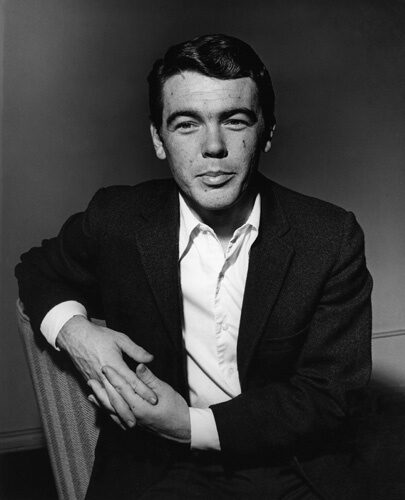

- Dirk Newman
- Woodrow Mellon
- Valerio Grato
- Clump baby
- La secretaría de defensa, Mimi Saito.
- Roberta, lider de Rinki
- Mauro Tavira, miembro de Rinki capturado, Epsteing Island?
- lastname: Agripa

- # Sam Ballard, babosa paralisis 
- Apellido: Masacota

- Rodolfo Pietro Filiberto Raffaelo Guglielm

- Viktor Lang, el jefe del partido del progreso.
- William Heart, el presidente del partido de la justicia y presidente actual de Saylor Capital.
# Pilotos Prono Racing
- Chip Keaton: Piloto campeon de Prono Racing 
- Kenzo Toro, piloto, su moto se llama 'Láser’
- Jim Tyler: Piloto, usa ‘Bailout’ 
- Luna 
- Villano: Kronmuller

- Sultano Meza
- Brucer Pipiano, Slavic suvvenir the cool guy [x]
- Paco Godnica 

- Apostolo George [x]

- Morgan Osca, anti-heroe con un perro tipo doberman y una voz con Alex Lora. 

- # Dubawy Frankell

- Wootton Baskset

- Wilmer Ruperti

- Bobby Driscoll, exitoso infantil, loco de tarde, acne

- Billy Peacock

- Rodolfo 'El Flautista' 

- Túpac Amaru

- Steeve Reese

- Peter Cake 

Fue apodado "Young Hickory" (Joven Nogal) debido a su asociación con el presidente Andrew Jackson, quien tenía el apodo de "Old Hickory" (Viejo Nogal).

- Homero, Horacio, Ovidio y Lucano

- Pablito Canario — Almirante marina Alondrina; error en ruta provoca pérdida de su flotilla; refugiado político en Velora (mini-arco Velora Cap 3).
- Marlon Mejillon — Ex coronel marina Velora; cachetón, 43 años; destituido por Nicolas Green por condenar a Pablito Canario; decide vengarse de Pablito y de Velora.