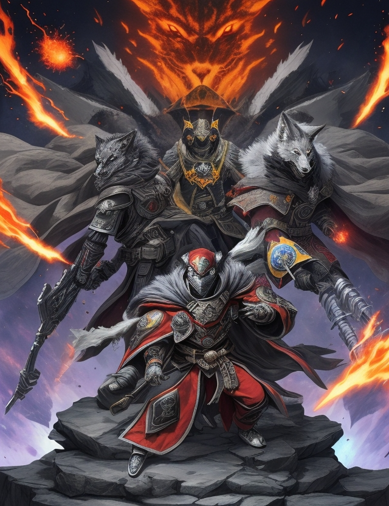
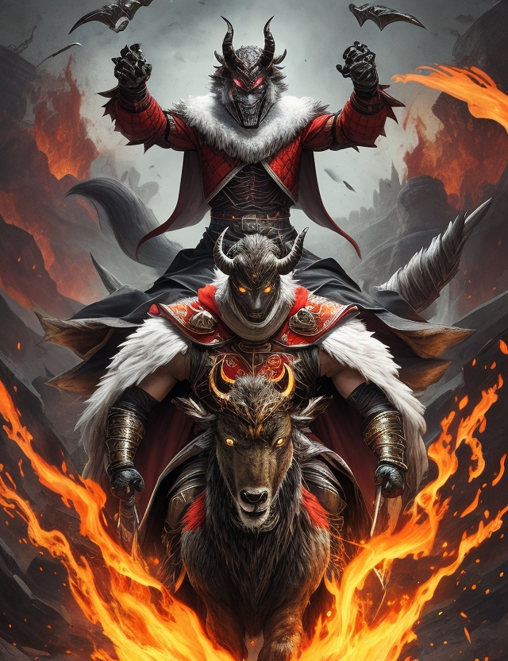

- Fuego es su simbolo
- La capitana se llama 'Honey', es parecida a 'Troncha-Toro' de 'Matilda'.
- Tienes telarañas echas de fuego
- Su caballeria monta sobre Carneros.
- Usan cabras de montaña para minar un mineral energetico muy valioso
- Toman decisiones mediante una cabra que come en un plato A o B.
- La cabra debe ser peliroja para poder tomar decisiones.
- Entran en conflicto con el gobierno por liberar a Piggy.
- El subcapitan se llama 'Harry' y se parece a Freddy Mercury.

- Tienen que matar a un tejon de miel gigante para ganar reputacion.

